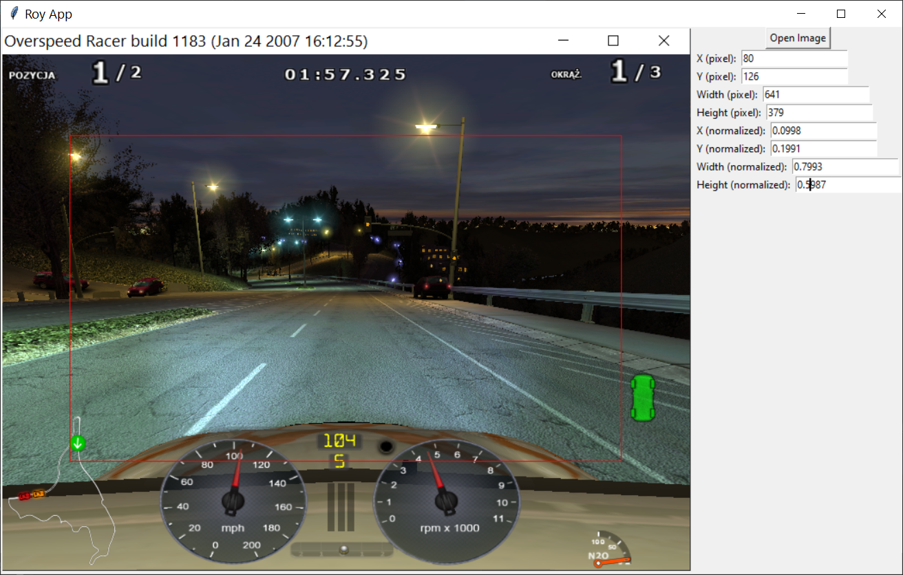

# roy-app

ROY App is a simple and user-friendly tool developed in Python and Tkinter for annotating regions of interest (ROI) in images.



## Features

- Load any image file supported by the Python Imaging Library (PIL).
- Draw bounding box around the region of interest.
- Display coordinates of bounding box in both pixel and normalized values.
- Manual input and modification of bounding box parameters.
- Input validation for bounding box parameters.
- Easy to use GUI interface.

## Installation

```
pip install git+https://github.com/PypayaTech/roy-app.git
```

## Usage

To start the app, run:

```bash
python roy_app/main.py
```

In the GUI:

1. Click on the `Open Image` button to open the image you want to annotate.
2. Draw bounding box on the image by clicking and dragging the mouse.
3. The coordinates of the bounding box will be automatically displayed in the entries on the right side.
4. You can manually modify the bounding box parameters by typing in the entries. Press `Enter` to apply the changes.
5. The coordinates are displayed in two formats: pixel values and normalized values (0-1 range).

## License

This project is licensed under the MIT License. See the [LICENSE](LICENSE) file for details.
